<div align="center">

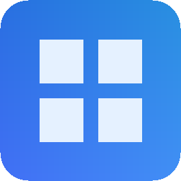

# Codex Glass

**Your Codex allowance, right on your Windows desktop.**

[English](README.md) · [简体中文](README.zh-CN.md) · [繁體中文](README.zh-TW.md)

**[⬇ Download for Windows](https://github.com/qyyzclthsay/Codex-Glass/releases/latest/download/Codex-Glass-0.5.2-Setup-x64.exe)** · [Portable & all downloads](https://github.com/qyyzclthsay/Codex-Glass/releases/latest)

**Free & open source · No additional AI tokens · No personal data sent to the developer**

<sub>Windows 10 / 11 · x64 · Requires locally installed official Codex and a ChatGPT account</sub>

[macOS native preview — Apple Silicon & Intel](docs/MACOS.md)

</div>

<table><tr><td align="center" width="22%"><b>Stay in view</b><br><br>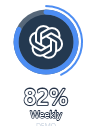</td><td align="center" width="22%"><b>Hover for numbers</b><br><br>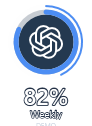</td><td align="center" width="56%"><b>Click to expand</b><br>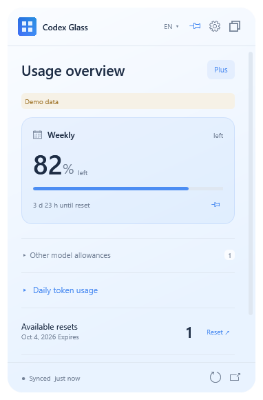</td></tr></table>

<p align="center"><sub>Drag the ring to move it. Screenshots use demo data.</sub></p>

## Get started

1. Install the official Codex desktop app or CLI. This widget monitors ChatGPT subscription allowance; third-party API keys are not supported.
2. Run Codex Glass. It reads an available local sign-in automatically; otherwise, choose **Sign in with ChatGPT**.
3. Use the overlapping-windows icon for compact mode. Hover to see numbers, click to expand, or drag to move.

**Download notice:** v0.5.2 is unsigned, so Edge or Windows may show a download or unknown-publisher warning. [Signing status](docs/CODE_SIGNING.md).

<details>
<summary>Portable versions, file sizes & checksums</summary>

| File | Purpose |
| --- | --- |
| [Setup-x64.exe](https://github.com/qyyzclthsay/Codex-Glass/releases/latest/download/Codex-Glass-0.5.2-Setup-x64.exe) | Recommended installer, about 128 KiB |
| [Portable-x64.exe](https://github.com/qyyzclthsay/Codex-Glass/releases/latest/download/Codex-Glass-0.5.2-Portable-x64.exe) | Standalone executable, about 192 KiB |
| [Portable-x64.zip](https://github.com/qyyzclthsay/Codex-Glass/releases/latest/download/Codex-Glass-0.5.2-Portable-x64.zip) | Portable executable and licenses |
| [SHA256SUMS](https://github.com/qyyzclthsay/Codex-Glass/releases/latest/download/SHA256SUMS-0.5.2.txt) | Download checksums |

Validated on Windows 10 22H2; Windows 11 and mixed-DPI configurations are not fully tested.

</details>

## 📊 Daily tokens and period totals

Choose **7 / 30 days**. Hover over a bar for one day; the top-right number totals the reported days in that period.

<table><tr><td align="center"><b>7 days · inspect a single day</b><br>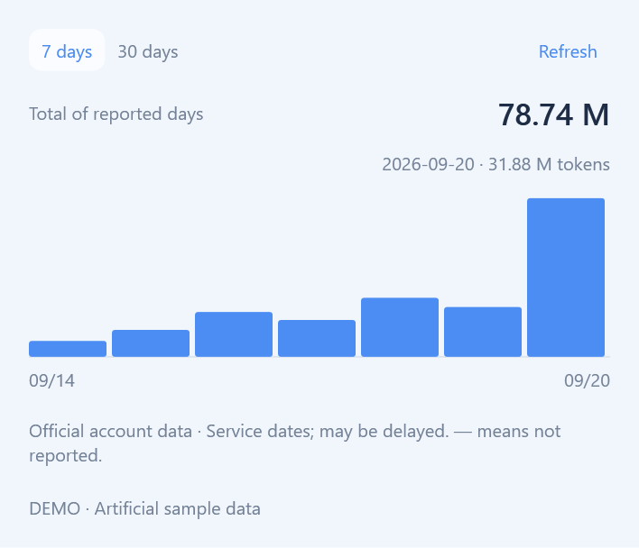</td><td align="center"><b>30 days · see the total</b><br>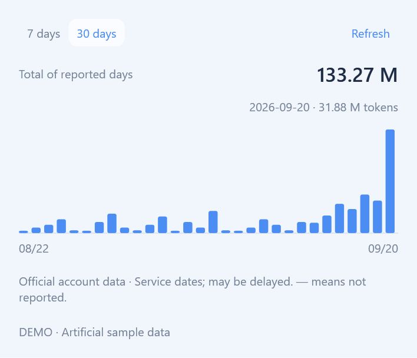</td></tr></table>

English uses **K / M / B**. Hover over the total for the exact count. Missing records stay `—`, not zero.

## 🎨 Make it yours

Pick a preset, or click the **square swatch** in Settings → Accent color to choose any color.

<table><tr><td align="center"><b>Choose a color</b><br>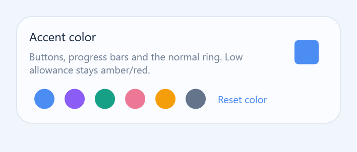</td><td align="center"><b>See it on your desktop</b><br>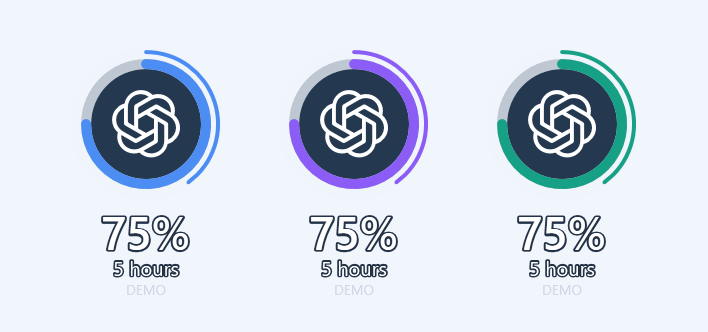</td></tr></table>

Buttons, progress bars and rings follow your accent. Low allowance keeps its amber / red warning colors. **Reset color** restores the default palette.

## ⏱ Allowance and time, together

Turn on **Elapsed time arc** in Settings → Status ring. The thick ring shows **allowance left**; the thin outer ring shows **time elapsed**.

<table><tr><td align="center"><b>Enable the outer ring</b><br>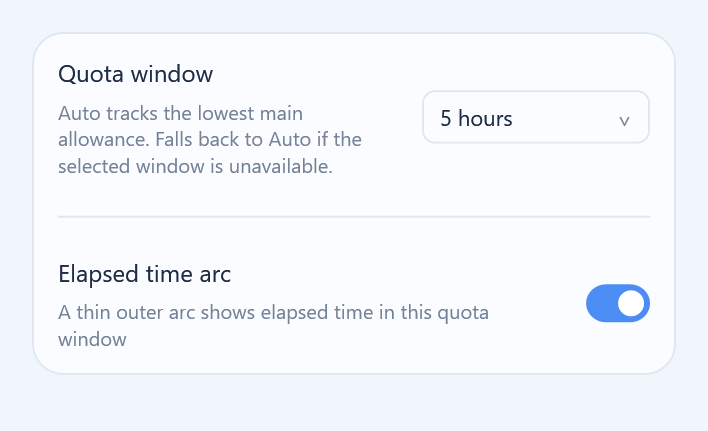</td><td align="center"><b>Off / On</b><br>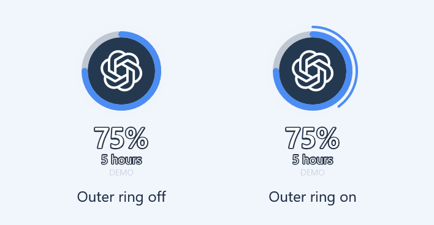</td></tr></table>

In this demo, **75% allowance remains** and **40% of the five-hour window has elapsed**. The outer ring follows your accent and is optional. Hover over the widget to reveal the numbers.

## Questions & details

The widget queries existing statistics without calling an AI model. It sends no account, usage or other personal data to the developer. Official Codex connects to OpenAI to sign in and fetch usage. [Privacy details](SECURITY.md).

<details>
<summary>Sign-in and automatic reading</summary>

On startup, the widget checks the current local Codex account and reads its allowance. **Browser sign-in starts only when you click the sign-in button.** “Read again” only retries the account and allowance check.

You do not need to open a Codex window first or keep the desktop app running. The widget starts the official `codex app-server` when needed. If the desktop app and widget use different credential stores or environments, you may still need to connect in the widget. Signing in to ChatGPT in a browser alone does not sign in to local Codex.

You can complete your first sign-in from the widget, provided official Codex is installed. After a successful sign-in, allowance is read automatically; this may update the current local Codex CLI account. The widget does not receive your password. Official Codex manages OAuth and credentials. API-key sign-in is not used for this ChatGPT subscription allowance monitor. See the [official OpenAI documentation](https://developers.openai.com/codex/app-server) for the account interface.

</details>

<details>
<summary>More features & dark theme</summary>

| At a glance | What you get |
| --- | --- |
| Remaining allowance | Service-reported 5-hour / weekly windows, plan and reset countdowns |
| Additional models | Separate model groups; independent pools never added to primary quotas |
| Daily usage | Flat 7 / 30-day token charts with hover and keyboard values |
| Resets & membership | Available resets; manual membership dates saved per account |
| Stay out of the way | Floating ring, pinning, corner resizing and scrolling within a fixed window |
| Make it yours | English / Simplified Chinese / Traditional Chinese menu, light / dark / system themes, custom accents |

<p align="center">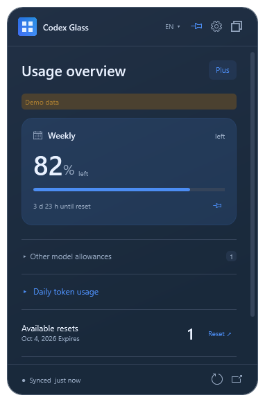</p>

</details>

<details>
<summary>How much memory does it use?</summary>

C# / WPF using the Windows-provided .NET Framework. No bundled Electron, Chromium, Node.js or WebView2. Downloads exclude the system framework and the separately installed official Codex runtime.

**Download size is not RAM usage.** See the [validation record](docs/VALIDATION.md) for current measurements and conditions. Private memory and working set are different metrics; usage varies with system, fonts and activity. The Codex helper exits after queries and stays connected only while browser sign-in is pending.

Reference measurement (v0.5.0, compact mode): **84.4 MiB private memory**, **119.9 MiB working set**, with no helper child after the query.

</details>

<details>
<summary>What data does it read or save?</summary>

**[MIT-licensed open source](LICENSE). The widget sends no account, usage or other personal data to the developer.** The current native app has no developer telemetry, analytics or data-collection endpoint.

| Where data goes | What happens |
| --- | --- |
| Official Codex → your widget | Reads account identity and plan, quota/reset information, and daily token counts needed for display and account separation |
| Your computer | Saves preferences, quota cache, reminder state and manually entered membership dates; account identifiers are hashed before saving |
| Developer | Receives no automatic reports from the widget; no passwords, conversations or usage data are uploaded to the developer |

The widget does not receive your password or scan conversations. Official Codex handles credentials and connects to OpenAI for sign-in and account queries; its own data handling is governed by OpenAI's policies. Daily token history stays in memory and is not written to the widget's cache.

- Quota reset dates are not membership expiry dates. Membership dates are explicitly manual.
- Daily reports may be delayed. Missing values remain `—`, distinct from zero. Pools stay separate.
- Reset opens the official usage page; it does not consume a reset credit.
- Default storage: `%APPDATA%\codex-usage-widget`. Local caches are not encrypted. Keep personal data directories out of public reports.

See [Security & privacy](SECURITY.md) for implementation details.

</details>

<details>
<summary>Build from source</summary>

Use Windows PowerShell and the system .NET Framework compiler. No Node.js or extra SDK required:

```powershell
powershell -NoProfile -ExecutionPolicy Bypass -File scripts/build-native.ps1 -Test
powershell -NoProfile -ExecutionPolicy Bypass -File scripts/qa-native.ps1
```

Install NSIS for packaging, then run `scripts/build-native.ps1 -Package`. Output goes to `dist/`.

| Environment variable | Purpose |
| --- | --- |
| `CODEX_GLASS_NSIS_PATH` | Path to `makensis.exe` |
| `CODEX_GLASS_CODEX_PATH` | Path to the official Codex executable |
| `CODEX_GLASS_DATA_DIR` | Widget data directory |

GitHub Actions builds and tests; maintainers publish Releases. The current implementation is in `native/`. Historical Electron code in `src/` and `tests/` is retained for reference and excluded from the current binary.

</details>

## Feedback & contributing

Found a bug or have an idea? [Open an issue](https://github.com/qyyzclthsay/Codex-Glass/issues). Include your Windows version, widget version and steps to reproduce; remove personal information from screenshots.

MIT · Independent community project, not an official OpenAI product. Service logos identify the monitored service.

[Contributing](CONTRIBUTING.md) · [Security](SECURITY.md) · [Architecture](docs/ARCHITECTURE.md) · [Third-party notices](THIRD_PARTY_NOTICES.md) · [Changelog](CHANGELOG.md)

Thanks to [Pulse](https://github.com/qunqin24/Pulse) for functional inspiration. Asset origins and licenses are preserved in the third-party notices.

---

<div align="center">

<h2>⭐ Support Codex Glass</h2>

<p><strong><a href="https://github.com/qyyzclthsay/Codex-Glass">If Codex Glass makes your day a little easier, give it a Star on GitHub.</a></strong></p>
<p>Your support helps more Codex users discover this project.</p>

</div>
