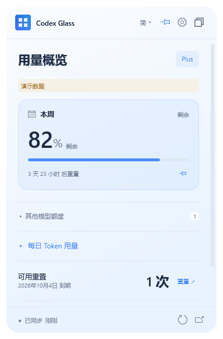
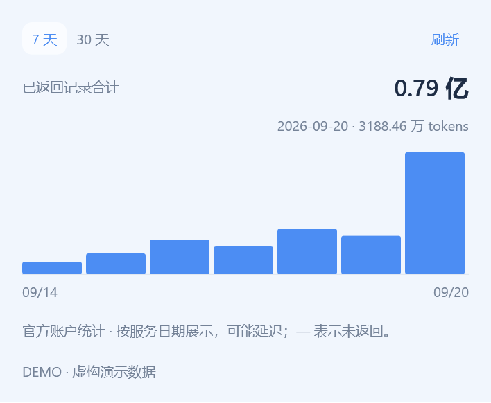
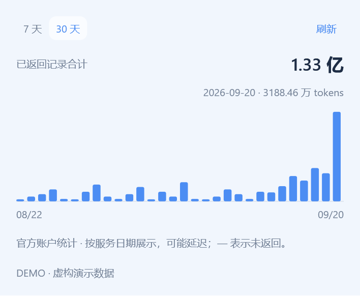
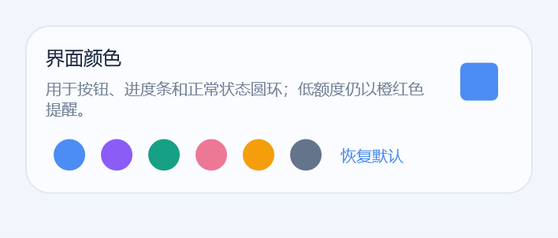
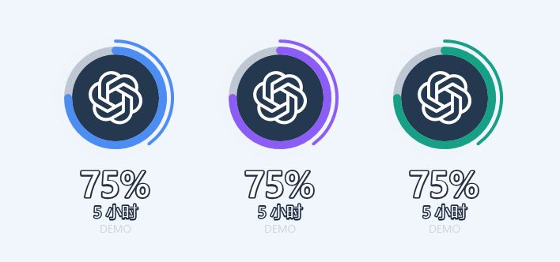
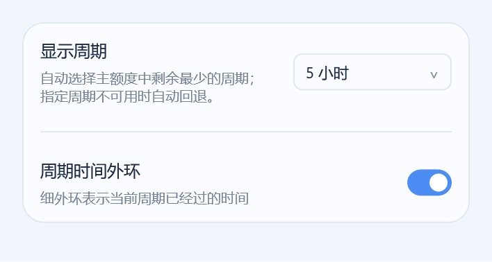
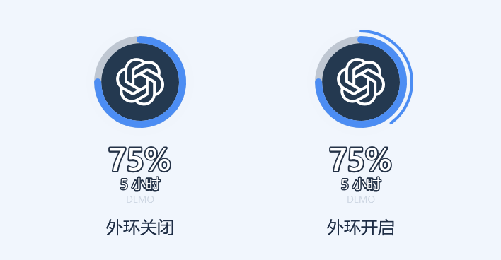

<div align="center">


# Codex Glass

**把 Codex 剩余额度，放在看得见的地方。**

Windows 10 / 11 · x64 · C# / WPF

[English](README.md) · [简体中文](README.zh-CN.md) · [繁體中文](README.zh-TW.md)

  

[下载最新版](https://github.com/qyyzclthsay/Codex-Glass/releases/latest) · [反馈问题](https://github.com/qyyzclthsay/Codex-Glass/issues) · [验证记录](docs/VALIDATION.md)

</div>

<table><tr><td align="center"><b>用量概览</b><br></td><td align="center"><b>深色主题</b><br></td></tr></table>

<p align="center"> <br><sub>平时只显示圆环，悬停显示数字；点击展开，拖动移动。截图均为演示数据。</sub></p>

## 小组件，随时可见

| 你关心的 | Codex Glass |
| --- | --- |
| 还剩多少 | 官方返回的 5 小时 / 每周额度、套餐与重置倒计时 |
| 其他模型 | 按模型分组，独立额度池不与主额度相加 |
| 每日用量 | 7 / 30 天 Token 柱状图，悬停或键盘查看数值 |
| 重置与会员 | 可用重置次数；会员日期手动填写、按账户保存 |
| 不挡住工作 | 迷你悬浮圆环、置顶、四角缩放、固定窗口内滚动 |
| 随你设置 | English / 简体 / 繁体 菜单，浅色 / 深色 / 系统主题，自定义颜色 |

## 📊 单日用了多少，总共用了多少

展开**每日 Token 用量**，切换 **7 天 / 30 天**。鼠标移到柱子上查看当天用量，右上角显示所选时间范围内已返回记录的合计。

<table><tr><td align="center"><b>7 天 · 查看单日</b><br></td><td align="center"><b>30 天 · 查看合计</b><br></td></tr></table>

单日用**万**、总计用**亿**，悬停总计可查看完整数字。繁体显示 **萬 / 億**，英文显示 **K / M / B**。图片均为虚构演示数据；缺失记录显示 `—`，不会当成零。

## 🎨 选一个你的颜色

在 **设置 → 界面颜色** 中选择预设色，或点击右侧的**方形色块**，自由挑选颜色。

<table><tr><td align="center"><b>选择颜色</b><br></td><td align="center"><b>看看桌面效果</b><br></td></tr></table>

按钮、进度条和圆环跟随你的配色；低额度仍保留橙红色提醒。点击**恢复默认**即可还原。

## ⏱ 额度和时间，一起看

在 **设置 → 圆环显示** 中打开**周期时间外环**。粗环看**还剩多少额度**，细外环看**周期已过多久**。

<table><tr><td align="center"><b>开启时间外环</b><br></td><td align="center"><b>关闭 / 开启</b><br></td></tr></table>

图中示例：**额度还剩 75%**，**5 小时周期已过去 40%**。外环跟随界面颜色，可随时关闭；悬停圆环即可查看数字。

## 下载与开始使用

**[下载 Windows 安装包](https://github.com/qyyzclthsay/Codex-Glass/releases/latest/download/Codex-Glass-0.5.2-Setup-x64.exe)**

| 文件 | 用途 |
| --- | --- |
| [Setup-x64.exe](https://github.com/qyyzclthsay/Codex-Glass/releases/latest/download/Codex-Glass-0.5.2-Setup-x64.exe) | 推荐安装版，约 128 KiB |
| [Portable-x64.exe](https://github.com/qyyzclthsay/Codex-Glass/releases/latest/download/Codex-Glass-0.5.2-Portable-x64.exe) | 单文件便携版，约 192 KiB |
| [Portable-x64.zip](https://github.com/qyyzclthsay/Codex-Glass/releases/latest/download/Codex-Glass-0.5.2-Portable-x64.zip) | 便携版与许可证 |
| [SHA256SUMS](https://github.com/qyyzclthsay/Codex-Glass/releases/latest/download/SHA256SUMS-0.5.2.txt) | 下载文件校验值 |

1. 在 Windows 10 / 11 x64 安装官方 Codex 桌面应用或 CLI，使本机可找到官方 Codex 可执行文件。
2. 安装或运行 Codex Glass。已有可读取的 ChatGPT 登录状态时，会自动显示额度；否则点击“使用 ChatGPT 登录”，在官方页面完成登录。
3. 顶部语言按钮可选择语言，双窗口图标进入迷你模式；拖标题栏或圆环移动。

构建尚未数字签名。已验证 Windows 10 22H2；Windows 11 与混合 DPI 尚未完整验证。

<details>
<summary>登录与自动读取</summary>

启动时自动检查本机 Codex 的当前账户并读取额度；**只有点击登录按钮才会发起浏览器登录**。“重新读取”仅重新检查账户和额度。

无需每次先打开 Codex 窗口，也无需让 Codex 桌面应用一直运行。组件会按需启动官方 `codex app-server`。如果桌面应用与组件使用不同的登录存储或运行环境，桌面端已登录也可能仍需在组件中连接。仅在浏览器登录 ChatGPT 不代表本机 Codex 已登录。

没有本机登录状态时，也可以直接从组件按钮完成首次登录，但仍需已安装官方 Codex。登录成功后自动读取额度；该操作可能更新本机 Codex CLI 的当前账户。组件不接收你的密码，OAuth 登录与凭据管理由官方 Codex 处理。API Key 登录不用于此处的 ChatGPT 订阅额度监控。接口说明见 [OpenAI 官方文档](https://developers.openai.com/zh-Hans/docs/app-server)。

</details>

## 体积与内存

C# / WPF 原生实现，使用 Windows 自带 .NET Framework，不捆绑 Electron、Chromium、Node.js 或 WebView2。安装包不包含系统框架和另行安装的官方 Codex。

**下载大小不等于运行内存。** 最新实测数据与条件见 [验证记录](docs/VALIDATION.md)。私有内存与工作集是不同口径，占用随系统、字体和操作变化。查询结束后释放 Codex 辅助进程；浏览器登录等待期间保留连接。

v0.5.0 本机基准实测：私有内存 **84.4 MiB**，工作集 **119.9 MiB**，查询后无辅助子进程。

## 开源与隐私

**本软件采用 [MIT 开源协议](LICENSE)，不会向开发者发送用户的账户、用量或其他个人信息。** 当前原生版本不含开发者遥测、分析埋点或数据收集接口。

| 数据去向 | 具体行为 |
| --- | --- |
| 官方 Codex → 本机组件 | 读取账户标识、套餐、额度与重置信息、每日 Token 统计，用于显示数据和区分账户 |
| 用户电脑本地 | 保存偏好设置、额度缓存、提醒状态和手动填写的会员日期；账户标识经过哈希处理后保存 |
| 开发者 | 不会通过组件收到自动上报，不会收到上传的密码、聊天内容或用量数据 |

组件不接收密码、不扫描聊天内容。凭据由官方 Codex 管理；登录和账户查询由官方 Codex 连接 OpenAI，其数据处理适用 OpenAI 自身政策。每日 Token 历史仅保留在内存中，不写入组件的磁盘缓存。

- 额度重置时间不等于会员到期时间，会员日期明确标记为手动填写。
- 每日记录可能延迟；缺失用 `—`，不冒充零；不同额度池分开显示。
- “重置”按钮只打开官方用量页，不直接消耗重置机会。
- 默认数据目录：`%APPDATA%\codex-usage-widget`。本地缓存未加密，请勿上传个人数据目录。

实现细节见[安全与隐私说明](SECURITY.md)。

## 从源码构建

使用 Windows PowerShell 和系统 .NET Framework 编译器，无需 Node.js 或额外 SDK：

```powershell
powershell -NoProfile -ExecutionPolicy Bypass -File scripts/build-native.ps1 -Test
powershell -NoProfile -ExecutionPolicy Bypass -File scripts/qa-native.ps1
```

安装包需安装 NSIS，再运行 `scripts/build-native.ps1 -Package`。产物位于 `dist/`。

| 环境变量 | 用途 |
| --- | --- |
| `CODEX_GLASS_NSIS_PATH` | 指定 `makensis.exe` |
| `CODEX_GLASS_CODEX_PATH` | 指定官方 Codex 可执行文件 |
| `CODEX_GLASS_DATA_DIR` | 指定组件数据目录 |

GitHub Actions 自动构建和测试；Release 由维护者发布。`native/` 是当前实现；`src/`、`tests/` 保留早期 Electron 参考源码，不编入当前程序。

## 开源

MIT · 社区独立项目，非 OpenAI 官方产品。服务 Logo 仅用于标识被监控服务。

[参与贡献](CONTRIBUTING.md) · [安全与隐私](SECURITY.md) · [技术架构](docs/ARCHITECTURE.md) · [第三方声明](THIRD_PARTY_NOTICES.md) · [更新记录](CHANGELOG.md)

感谢 [Pulse](https://github.com/qunqin24/Pulse) 提供功能逻辑参考；素材来源与许可保留在第三方声明中。
