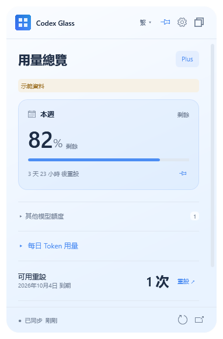
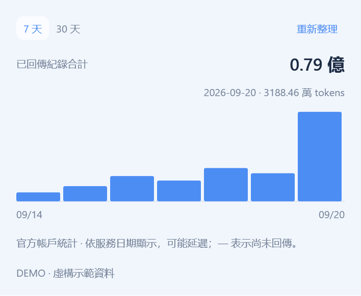
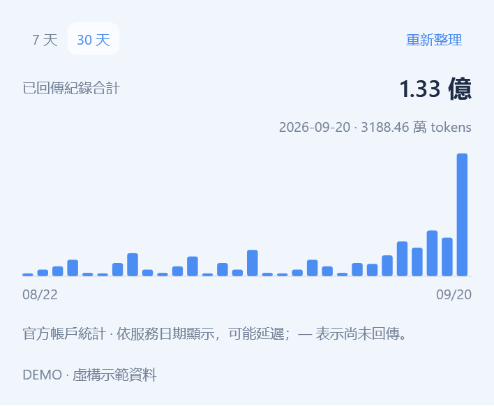
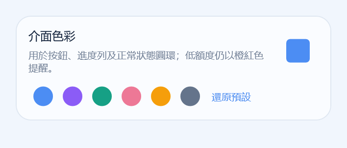
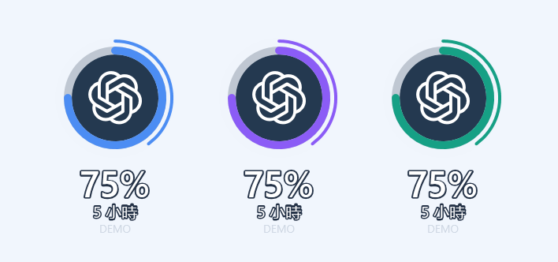
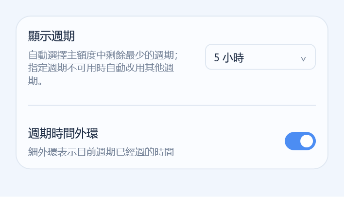
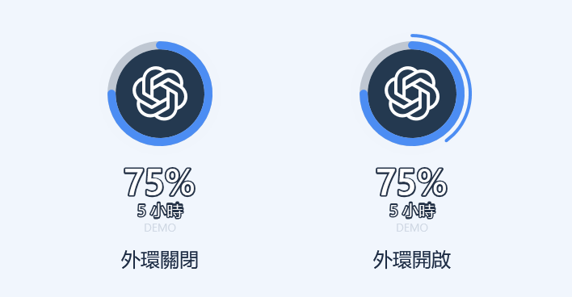

<div align="center">


# Codex Glass

**讓 Codex 剩餘額度，隨時顯示在 Windows 桌面上。**

[English](README.md) · [简体中文](README.zh-CN.md) · [繁體中文](README.zh-TW.md)

**[⬇ 下載 Windows 安裝程式](https://github.com/qyyzclthsay/Codex-Glass/releases/latest/download/Codex-Glass-0.5.2-Setup-x64.exe)** · [可攜版與全部下載](https://github.com/qyyzclthsay/Codex-Glass/releases/latest)

**免費開源 · 監控不額外消耗 Token · 不向開發者上傳個人資訊**

<sub>Windows 10 / 11 · x64 · 須在本機安裝官方 Codex，並使用 ChatGPT 帳戶</sub>

</div>

<table><tr><td align="center" width="22%"><b>桌面常駐</b><br><br></td><td align="center" width="22%"><b>停留查看數字</b><br><br></td><td align="center" width="56%"><b>點擊展開用量</b><br></td></tr></table>

<p align="center"><sub>拖曳圓環即可移動位置。截圖均使用示範資料。</sub></p>

<p align="center">如果這個小工具對你有幫助，歡迎點個 ⭐ Star。</p>

## 開始使用

1. 安裝官方 Codex 桌面應用程式或 CLI。本工具讀取 ChatGPT 訂閱額度，暫不支援第三方平台的 API Key。
2. 執行 Codex Glass，自動讀取本機可用的登入狀態；尚未登入時，點擊**使用 ChatGPT 登入**。
3. 點擊雙視窗圖示進入迷你模式。滑鼠停留看數字，點擊展開，拖曳即可移動。

**下載提示：**v0.5.2 尚未數位簽章，Edge 或 Windows 可能提示不常下載或未知的發行者。[查看簽章狀態](docs/CODE_SIGNING.md)。

<details>
<summary>可攜版、檔案大小與校驗值</summary>

| 檔案 | 用途 |
| --- | --- |
| [Setup-x64.exe](https://github.com/qyyzclthsay/Codex-Glass/releases/latest/download/Codex-Glass-0.5.2-Setup-x64.exe) | 推薦安裝版，約 128 KiB |
| [Portable-x64.exe](https://github.com/qyyzclthsay/Codex-Glass/releases/latest/download/Codex-Glass-0.5.2-Portable-x64.exe) | 單檔可攜版，約 192 KiB |
| [Portable-x64.zip](https://github.com/qyyzclthsay/Codex-Glass/releases/latest/download/Codex-Glass-0.5.2-Portable-x64.zip) | 可攜版與授權文件 |
| [SHA256SUMS](https://github.com/qyyzclthsay/Codex-Glass/releases/latest/download/SHA256SUMS-0.5.2.txt) | 下載檔案校驗值 |

已驗證 Windows 10 22H2；Windows 11 與混合 DPI 尚未完整驗證。

</details>

## 📊 單日用了多少，總共用了多少

切換 **7 天 / 30 天**，將滑鼠移到長條上看當天用量，右上角看所選時段內已回傳紀錄的合計。

<table><tr><td align="center"><b>7 天 · 查看單日</b><br></td><td align="center"><b>30 天 · 查看合計</b><br></td></tr></table>

單日用**萬**，總計用**億**；滑鼠停留在總計上可看完整數字。缺少紀錄顯示 `—`，不會當成零。

## 🎨 選一個你的色彩

在 **設定 → 介面色彩** 中選擇預設色，或點擊右側的**方形色塊**，自由挑選色彩。

<table><tr><td align="center"><b>選擇色彩</b><br></td><td align="center"><b>看看桌面效果</b><br></td></tr></table>

按鈕、進度條與圓環跟隨你的配色；低額度仍保留橙紅色提醒。點擊**還原預設**即可還原。

## ⏱ 額度與時間，一起看

在 **設定 → 圓環顯示** 中開啟**週期時間外環**。粗環看**還剩多少額度**，細外環看**週期已過多久**。

<table><tr><td align="center"><b>開啟時間外環</b><br></td><td align="center"><b>關閉 / 開啟</b><br></td></tr></table>

圖中範例：**額度還剩 75%**，**5 小時週期已過去 40%**。外環跟隨介面色彩，可隨時關閉；滑鼠停留在圓環上即可查看數字。

## 常見問題與詳細說明

監控僅查詢既有統計，不呼叫 AI 模型，不額外消耗 Token。元件不會向開發者傳送帳戶、用量或其他個人資訊；官方 Codex 會連線至 OpenAI 完成登入與用量查詢。[隱私說明](SECURITY.md)。

<details>
<summary>登入與自動讀取</summary>

啟動時自動檢查本機 Codex 的目前帳戶並讀取額度；**只有點擊登入按鈕才會啟動瀏覽器登入**。「重新讀取」僅重新檢查帳戶與額度。

不必每次先開啟 Codex 視窗，也不必讓 Codex 桌面應用程式持續執行。元件會按需啟動官方 `codex app-server`。若桌面應用程式與元件使用不同的登入儲存位置或執行環境，桌面端已登入也可能仍需在元件中連線。僅在瀏覽器登入 ChatGPT 不代表本機 Codex 已登入。

沒有本機登入狀態時，也可以直接從元件按鈕完成首次登入，但仍須已安裝官方 Codex。登入成功後自動讀取額度；此操作可能更新本機 Codex CLI 的目前帳戶。元件不接收你的密碼，OAuth 登入與憑證管理由官方 Codex 處理。API Key 登入不適用於此處的 ChatGPT 訂閱額度監控。介面說明見 [OpenAI 官方文件](https://developers.openai.com/zh-Hant/docs/app-server)。

</details>

<details>
<summary>更多功能與深色主題</summary>

| 你關心的 | Codex Glass |
| --- | --- |
| 還剩多少 | 官方回傳的 5 小時 / 每週額度、方案及重設倒數 |
| 其他模型 | 依模型分組，獨立額度池不與主額度相加 |
| 每日用量 | 7 / 30 天 Token 長條圖，滑鼠停留或鍵盤查看數值 |
| 重設與會員 | 可用重設次數；會員日期手動填寫、依帳戶儲存 |
| 不遮擋工作 | 迷你懸浮圓環、置頂、四角縮放、固定視窗內捲動 |
| 隨你設定 | English / 簡體 / 繁體 選單，淺色 / 深色 / 系統主題，自訂色彩 |

<p align="center"></p>

</details>

<details>
<summary>執行時占多少記憶體？</summary>

C# / WPF 原生實作，使用 Windows 提供的 .NET Framework，不附帶 Electron、Chromium、Node.js 或 WebView2。安裝程式不包含系統框架與另行安裝的官方 Codex。

**下載大小不等於執行記憶體。** 最新實測數據與條件見 [驗證紀錄](docs/VALIDATION.md)。私有記憶體與工作集是不同指標，用量會隨系統、字型與操作改變。查詢結束後釋放 Codex 輔助程序；瀏覽器登入等待期間保留連線。

v0.5.0 本機基準實測：私有記憶體 **84.4 MiB**，工作集 **119.9 MiB**，查詢後無輔助子程序。

</details>

<details>
<summary>會讀取和儲存哪些資料？</summary>

**本軟體採用 [MIT 開源授權](LICENSE)，不會向開發者傳送使用者的帳戶、用量或其他個人資訊。** 目前原生版本不含開發者遙測、分析追蹤或資料收集介面。

| 資料去向 | 具體行為 |
| --- | --- |
| 官方 Codex → 本機元件 | 讀取帳戶識別資訊、方案、額度與重設資訊、每日 Token 統計，用於顯示資料及區分帳戶 |
| 使用者電腦本機 | 儲存偏好設定、額度快取、提醒狀態及手動填寫的會員日期；帳戶識別資訊經雜湊處理後儲存 |
| 開發者 | 不會透過元件收到自動回報，不會收到上傳的密碼、聊天內容或用量資料 |

元件不接收密碼、不掃描聊天內容。憑證由官方 Codex 管理；登入與帳戶查詢由官方 Codex 連線至 OpenAI，其資料處理適用 OpenAI 自身政策。每日 Token 歷史僅保留在記憶體中，不寫入元件的磁碟快取。

- 額度重設時間不等於會員到期時間，會員日期明確標示為手動填寫。
- 每日紀錄可能延遲；缺少資料以 `—` 顯示，不當作零；各額度池分別顯示。
- 「重設」按鈕僅開啟官方用量頁面，不直接消耗重設機會。
- 預設資料目錄：`%APPDATA%\codex-usage-widget`。本機快取未加密，請勿上傳個人資料目錄。

實作細節見[安全與隱私說明](SECURITY.md)。

</details>

<details>
<summary>從原始碼建置</summary>

使用 Windows PowerShell 與系統 .NET Framework 編譯器，無需 Node.js 或額外 SDK：

```powershell
powershell -NoProfile -ExecutionPolicy Bypass -File scripts/build-native.ps1 -Test
powershell -NoProfile -ExecutionPolicy Bypass -File scripts/qa-native.ps1
```

安裝程式需安裝 NSIS，再執行 `scripts/build-native.ps1 -Package`。產物位於 `dist/`。

| 環境變數 | 用途 |
| --- | --- |
| `CODEX_GLASS_NSIS_PATH` | 指定 `makensis.exe` |
| `CODEX_GLASS_CODEX_PATH` | 指定官方 Codex 執行檔 |
| `CODEX_GLASS_DATA_DIR` | 指定元件資料目錄 |

GitHub Actions 自動建置與測試；Release 由維護者發布。`native/` 是目前實作；`src/`、`tests/` 保留早期 Electron 參考原始碼，不編入目前程式。

</details>

## 回饋與參與

遇到問題或有新想法？歡迎[提交 Issue](https://github.com/qyyzclthsay/Codex-Glass/issues)，附上 Windows 版本、軟體版本與重現步驟；截圖請隱去個人資訊。

MIT · 社群獨立專案，非 OpenAI 官方產品。服務 Logo 僅用於識別受監控的服務。

[參與貢獻](CONTRIBUTING.md) · [安全與隱私](SECURITY.md) · [技術架構](docs/ARCHITECTURE.md) · [第三方聲明](THIRD_PARTY_NOTICES.md) · [更新紀錄](CHANGELOG.md)

感謝 [Pulse](https://github.com/qunqin24/Pulse) 的功能邏輯參考；素材來源與授權保留於第三方聲明。
