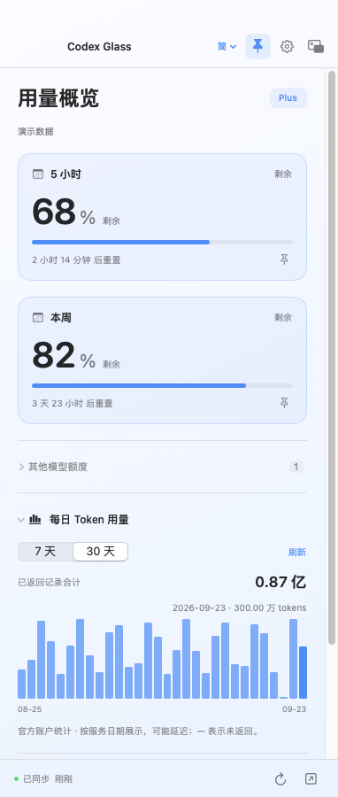
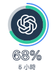

# Codex Glass for macOS

The macOS edition ports the Windows 0.5.2 feature set to **SwiftUI and AppKit**.
It does not embed Electron, Chromium, a web view, Node.js, or the Codex runtime.
Version **0.6.0-beta.1** is a macOS preview; the Windows release remains 0.5.2.

[English](#requirements) · [简体中文](#简体中文) · [繁體中文](#繁體中文)

<table><tr><td align="center"><b>Allowance & daily tokens</b><br></td><td align="center"><b>Quiet at rest</b><br><br><b>Hover for details</b><br></td></tr></table>

Screenshots are rendered by the packaged Mac app using artificial demo data.

## Requirements

- macOS 13 Ventura or newer.
- Apple Silicon (`arm64`) or Intel (`x86_64`); use the matching package.
- The official Codex desktop app or CLI installed on this Mac.
- A ChatGPT account accessible through the official local Codex runtime.
  Third-party API keys and API credit balances are not supported.

## What carries over

| Feature | macOS behavior |
| --- | --- |
| Allowance | Separate 5-hour, weekly and additional-model pools, with reset countdowns |
| Compact mode | Draggable floating ring; click to expand, hover to reveal percentage and period |
| Time arc | Optional thin outer arc for elapsed time, using the custom accent color |
| Daily tokens | 7 / 30-day bar charts, individual-day values and reported-period totals |
| Personalization | English, Simplified Chinese, Traditional Chinese; system/light/dark; custom color |
| Desktop integration | Menu-bar access, pinning, window resizing, fixed-height scrolling |
| Preferences | Refresh interval, optional notifications and launch at login |
| Membership | Manual dates isolated by account; the reset action opens the official usage page |

Monitoring reads existing statistics. It makes no AI model calls and consumes no additional AI tokens.

## Install and connect

Download the matching DMG directly; no GitHub sign-in is required:

| Mac | Download |
| --- | --- |
| Apple Silicon (M-series) | [Apple Silicon DMG · 0.91 MB](https://github.com/qyyzclthsay/Codex-Glass/releases/download/v0.6.0-beta.1/Codex-Glass-0.6.0-beta.1-macOS-arm64.dmg) |
| Intel | [Intel DMG · 0.96 MB](https://github.com/qyyzclthsay/Codex-Glass/releases/download/v0.6.0-beta.1/Codex-Glass-0.6.0-beta.1-macOS-x86_64.dmg) |

[ZIP packages, SHA-256 checksums & release notes](https://github.com/qyyzclthsay/Codex-Glass/releases/tag/v0.6.0-beta.1).
Check **Apple menu → About This Mac**: an Apple M-series chip uses `arm64`; an Intel processor uses `x86_64`.

Open the matching DMG and drag **Codex Glass** to **Applications**, or extract the app from the ZIP.
Launch it after installing official Codex. An available local ChatGPT sign-in is read automatically;
browser OAuth begins only when you press the sign-in button. The Codex app does not need to stay open.

These preview builds have an **ad-hoc signature only**, not an Apple Developer ID signature
or notarization. macOS may block downloaded applications or show an unidentified-developer warning.
The package does not disable Gatekeeper or alter security settings. See Apple's
[guidance for opening apps](https://support.apple.com/102445) and the [signing policy](CODE_SIGNING.md).

If Codex cannot be found, install its official CLI in `/opt/homebrew/bin` or `/usr/local/bin`,
or provide its absolute executable path through `CODEX_GLASS_CODEX_PATH` when launching from a terminal.
The app also checks Codex's application bundle and the process PATH. Finder-launched apps do not
necessarily inherit the PATH in your interactive shell.

## Privacy and local files

The Mac app does not send personal information to the maintainer or scan conversations. It delegates
authentication and account queries to official Codex, which connects to OpenAI. It never reads `auth.json`
or asks for API keys. Account identifiers are hashed before being persisted.

Settings and the quota cache live in `~/Library/Application Support/Codex Glass`.
`CODEX_GLASS_DATA_DIR` can select a different profile. Files are local and unencrypted;
daily token history stays in memory. Window positions and deduplicated reminder state
use macOS application preferences (UserDefaults); reminder identifiers use hashed account IDs.
See [Security](../SECURITY.md).

## Build and verify

On a Mac with Xcode command-line tools:

```bash
bash scripts/build-macos.sh
bash scripts/qa-macos.sh
```

The first command runs Swift tests, builds for the host architecture, creates an `.app`,
applies an ad-hoc signature, and produces a DMG, ZIP and SHA-256 manifest in `dist/macos-<architecture>`.
It requires no third-party Swift packages. Build on each architecture for the two distributions.

The QA script uses artificial demo data only. It runs the packaged application with its original
build-time resources hidden, captures overview/settings/mini screens, and samples demo process RSS.
Demo RSS is not a measurement of authenticated polling or long-running memory use.
It must not be compared directly to the Windows private-memory figure.

GitHub Actions runs on both Apple Silicon and Intel macOS runners. macOS 13 is the deployment target;
hosted CI on newer macOS is not a substitute for testing macOS 13 on a real desktop.
Multi-monitor behavior, login items, notification permission prompts and live account sign-in
still need hands-on Mac verification before declaring a stable release.

### Preview validation — 2026-09-23

[Source commit `552433c`](https://github.com/qyyzclthsay/Codex-Glass/commit/552433c2f244826ecd14e7f8d50ccc002f7de2f0)
passed 28 core/protocol tests on **each architecture**, release compilation, signature verification
and packaged-app startup. Nine screenshots per architecture cover three languages, dark mode,
settings, mini states and 7 / 30-day charts. SHA-256 manifests and executable architectures were checked after download.

| Package | DMG download | Unpacked app files | Demo RSS samples |
| --- | ---: | ---: | ---: |
| Apple Silicon | 907,268 bytes | 1,924,433 bytes | 50.30–51.77 MiB |
| Intel | 960,197 bytes | 1,966,593 bytes | 49.38–50.86 MiB |

RSS was sampled at approximately 2, 7 and 12 seconds after a separate demo overview launch,
with no account connected and no child processes. These short samples are **not a memory limit**
and exclude the official Codex helper used during authenticated queries. File totals are logical
bytes, not filesystem allocation. See [validation history](VALIDATION.md).

## 简体中文

这是基于 Windows 0.5.2 功能开发的 **macOS 原生预览版**，使用 SwiftUI / AppKit，
不附带浏览器引擎。支持 macOS 13 及以上，分别提供 Apple 芯片和 Intel 版本。

额度、迷你悬浮圆环、悬停数字、周期时间外环、每日 Token 柱状图、自定义颜色和三语言界面均已移植。
监控只查询已有统计，不额外消耗 Token。需要本机安装官方 Codex，并使用 ChatGPT 账户。

安装时将 DMG 中的应用拖入「应用程序」。预览版尚无 Apple 开发者签名或公证，
系统可能提示无法验证开发者；软件不会修改系统安全设置。

当前由 GitHub 的 Mac 环境进行构建与自动验证。真实账户登录、多显示器、通知和登录时启动
仍需 Mac 实机确认。两种芯片均已通过 28 项核心测试和安装包启动检查；DMG 不到 1 MB，
演示主界面短时内存采样约 49–52 MiB。这不是实际账户监控或长期运行的内存上限。
在[发布页](https://github.com/qyyzclthsay/Codex-Glass/releases/tag/v0.6.0-beta.1)直接下载安装包，无需登录 GitHub。
Apple 菜单 →「关于本机」中显示 M 系列芯片的选 `arm64`，Intel 处理器选 `x86_64`。

## 繁體中文

這是依 Windows 0.5.2 功能開發的 **macOS 原生預覽版**，使用 SwiftUI / AppKit，
不附帶瀏覽器引擎。支援 macOS 13 以上，分別提供 Apple 晶片與 Intel 版本。

額度、迷你懸浮圓環、停留顯示數字、週期時間外環、每日 Token 長條圖、自訂色彩及三語介面均已移植。
監控僅查詢既有統計，不額外消耗 Token。須在本機安裝官方 Codex，並使用 ChatGPT 帳戶。

安裝時將 DMG 中的 App 拖入「應用程式」。預覽版尚無 Apple 開發者簽章或公證，
系統可能提示無法驗證開發者；軟體不會修改系統安全設定。

目前由 GitHub 的 Mac 環境執行建置與自動驗證。真實帳戶登入、多螢幕、通知及登入時啟動
仍須 Mac 實機確認。兩種晶片均已通過 28 項核心測試及套件啟動檢查；DMG 不到 1 MB，
示範主畫面短時間記憶體採樣約 49–52 MiB。這不是實際帳戶監控或長期執行的記憶體上限。
在[發佈頁](https://github.com/qyyzclthsay/Codex-Glass/releases/tag/v0.6.0-beta.1)直接下載安裝檔，無須登入 GitHub。
Apple 選單 →「關於這台 Mac」中顯示 M 系列晶片的選 `arm64`，Intel 處理器選 `x86_64`。
